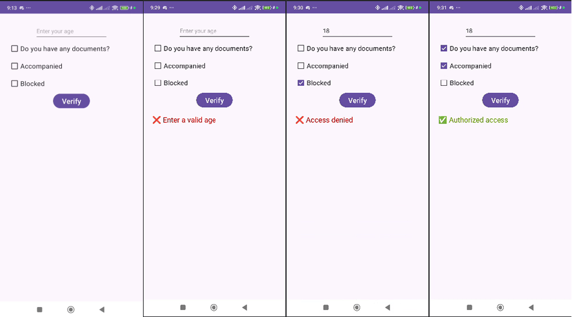

<h1 align="center">📱 Access Control System</h1>

Android application developed in <b>Kotlin</b> to simulate a real access validation system.

<h2>📋 About the Project</h2>

The application performs validations such as:

<ul>
  <li>✅ Minimum age verification</li>
  <li>✅ Valid document verification</li>
  <li>✅ Responsible companion verification</li>
  <li>✅ Blocked user verification</li>
</ul>

The application uses logical operators 
(<b>&&</b>, <b>||</b>, <b>!</b>) 
to control access permissions, displaying authorized or denied messages according to the defined rules.

<h2>🚀 Technologies Used</h2>

<ul>
  <li>Kotlin</li>
  <li>Android Studio</li>
  <li>XML Layout</li>
  <li>ConstraintLayout</li>
  <li>LinearLayout</li>
  <li>Conditional Logic</li>
  <li>Click Events (setOnClickListener)</li>
</ul>

<h2>🧠 Concepts Applied</h2>

<ul>
  <li>Data validation</li>
  <li>Error handling</li>
  <li>Type conversion</li>
  <li>Conditional structures</li>
  <li>Logical operators</li>
  <li>Graphical interface interaction</li>
</ul>

<h2>📌 Features</h2>

<ul>
  <li>Age input</li>
  <li>Permission selection using CheckBox</li>
  <li>Automatic validation</li>
  <li>Visual feedback for the user</li>
</ul>

<h2>💡 Project Objective</h2>

Practice Android development, programming logic, and interactive application building using Kotlin.

<h2>📷 Project Preview</h2>

  

<h1 align="center">📱 Sistema de Controle de Acesso</h1>

Aplicativo Android desenvolvido em <b>Kotlin</b> com o objetivo de simular um sistema real de validação de acesso.

<h2>📋 Sobre o Projeto</h2>

O aplicativo realiza verificações de:

<ul>
  <li>✅ Idade mínima</li>
  <li>✅ Documento válido</li>
  <li>✅ Acompanhante responsável</li>
  <li>✅ Usuário bloqueado</li>
</ul>

A aplicação utiliza operadores lógicos 
(<b>&&</b>, <b>||</b>, <b>!</b>) 
para controlar as permissões de entrada, exibindo mensagens de acesso permitido ou negado de acordo com as regras definidas.

<h2>🚀 Tecnologias Utilizadas</h2>

<ul>
  <li>Kotlin</li>
  <li>Android Studio</li>
  <li>XML Layout</li>
  <li>ConstraintLayout</li>
  <li>LinearLayout</li>
  <li>Lógica Condicional</li>
  <li>Eventos de clique (setOnClickListener)</li>
</ul>

<h2>🧠 Conceitos Aplicados</h2>

<ul>
  <li>Validação de dados</li>
  <li>Tratamento de erros</li>
  <li>Conversão de tipos</li>
  <li>Estruturas condicionais</li>
  <li>Operadores lógicos</li>
  <li>Interação com interface gráfica</li>
</ul>

<h2>📌 Funcionalidades</h2>

<ul>
  <li>Entrada de idade</li>
  <li>Seleção de permissões via CheckBox</li>
  <li>Validação automática</li>
  <li>Feedback visual ao usuário</li>
</ul>

<h2>💡 Objetivo do Projeto</h2>

Praticar desenvolvimento Android, lógica de programação e construção de aplicações interativas utilizando Kotlin.

<h2>📷 Preview do Projeto</h2>

  

